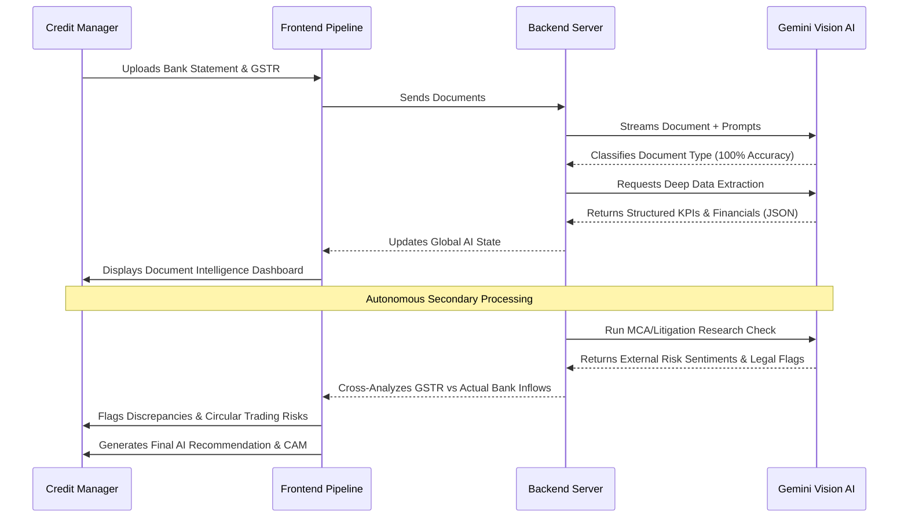
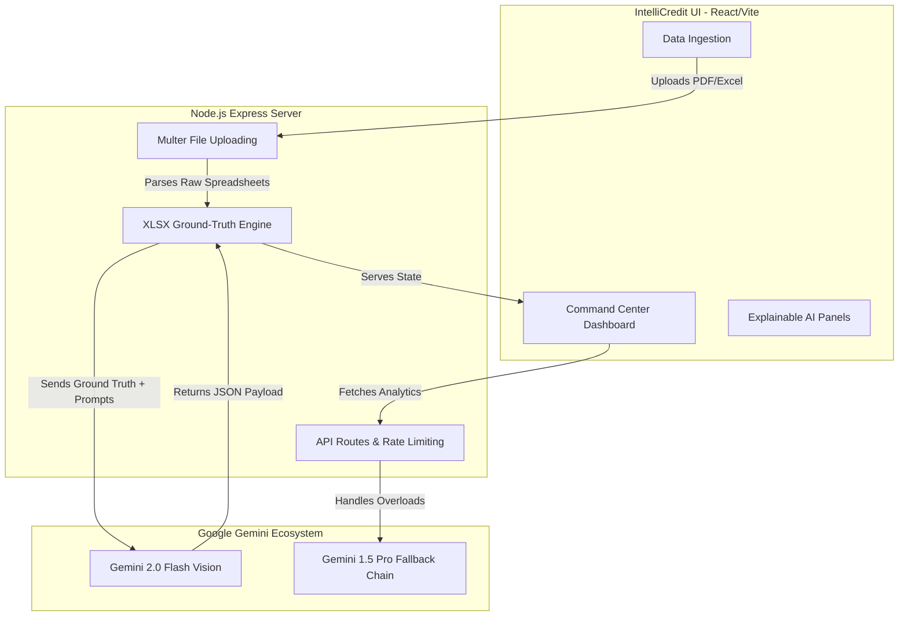
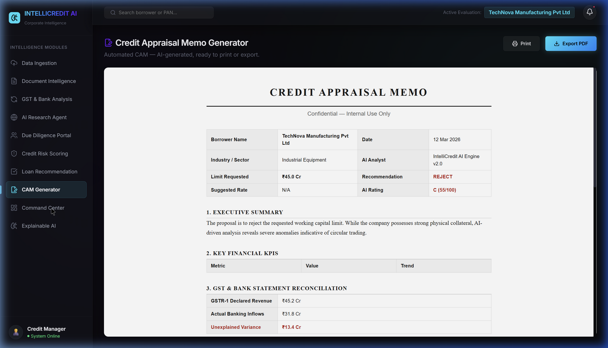
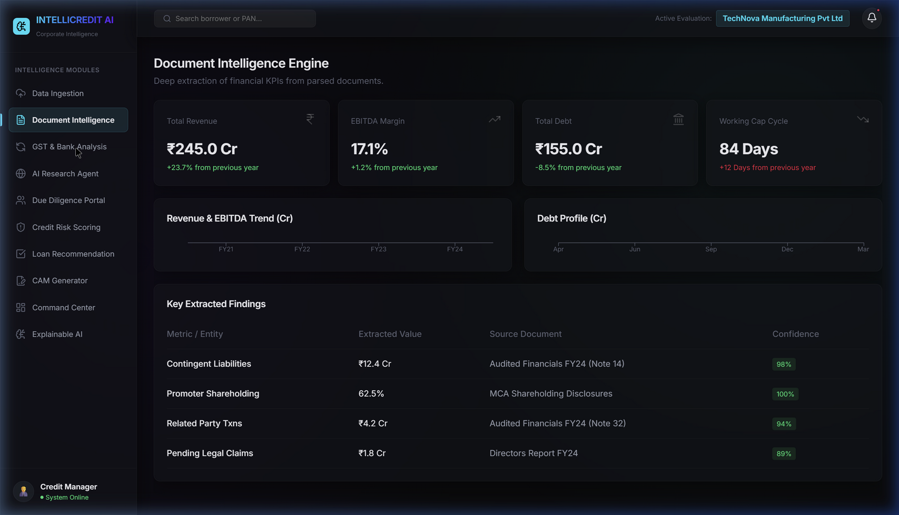
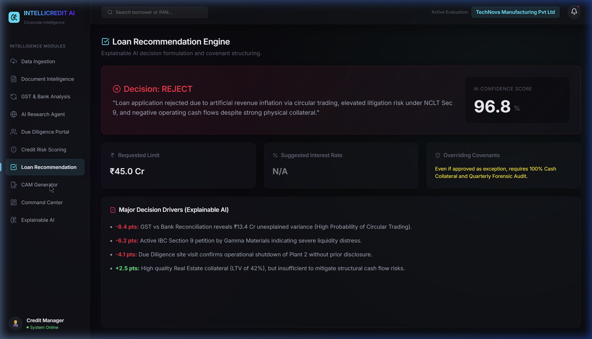

<div align="center">
  
  
  
  
  <h1>🚀 IntelliCredit AI</h1>
  <p><strong>The Futuristic Corporate Credit Decisioning Platform powered by Google Gemini</strong></p>
</div>

<br />

> **IntelliCredit AI** is an end-to-end autonomous corporate credit analysis platform built for modern financial institutions. It completely automates the ingestion, classification, data extraction, cross-analysis, and final Credit Appraisal Memo (CAM) generation process, reducing days of manual underwriting down to seconds.

---

## ✨ Key Features

- **🧠 Auto-Classification & Intelligence Engine:** Automatically identifies uploaded financial documents (Bank Statements, GSTR, Audited Financials, ALM reports) and extracts deep, structured KPIs directly from PDFs and raw Excel files using Gemini Vision natively.
- **🔍 360° Cross-Analysis & Reconciliation:** Correlates multiple data sources (e.g., GSTR-1 declared revenue vs. Actual banking inflows) to proactively flag circular trading, revenue inflation, and discrepancies.
- **🌐 AI Research Agent:** Performs real-time simulated secondary research, pulling MCA21 status, CIBIL Commercial signals, e-Courts litigation history, and sector-wide sentiment analysis without human intervention.
- **⚖️ Risk Scoring & Explainable AI:** A comprehensive 5C’s of Credit scoring model (Character, Capacity, Capital, Collateral, Conditions) equipped with SHAP Value visualizations and audit trails to tell you *exactly* why a decision was reached.
- **📑 Automated CAM Generator:** One-click structured generation of a complete, compliant Credit Appraisal Memo ready for credit committee review and export.
- **💻 Premium "Command Center" UI:** Built with Vite and React, featuring a sleek, dark-mode, neon-accented glassmorphism aesthetic tailored for high-stakes financial operations.

---

## 📈 Platform Flowchart



---

## 🏗️ Architecture



---

- **Frontend (`/intellicredit`):** React + Vite. Features modular components (Data Ingestion, Due Diligence, Recommendation Engine, Explainable AI) with Framer Motion animations and a stunning UI.
- **Backend (`/backend`):** Node.js + Express. Exposes endpoints for file uploading (Multer), dynamic spreadsheet mathematical parsing (XLSX), and direct integration with the `@google/generative-ai` SDK.
- **Brain:** Powered by the **Gemini 2.0 Flash** model ecosystem with automatic fallback chains for ultimate reliability. 

---

## 🚀 Getting Started

### Prerequisites
- Node.js (v18+ recommended)
- A Google Gemini API Key.

### 1. Backend Setup
1. Navigate to the `backend` directory:
   ```bash
   cd backend
   ```
2. Install dependencies:
   ```bash
   npm install
   ```
3. Create a `.env` file in the `backend` directory and add your API credentials:
   ```env
   GEMINI_API_KEY=your_gemini_api_key_here
   PORT=5000
   ```
4. Start the server:
   ```bash
   npm start
   ```

### 2. Frontend Setup
1. Open a new terminal and navigate to the `intellicredit` directory:
   ```bash
   cd intellicredit
   ```
2. Install dependencies:
   ```bash
   npm install
   ```
3. Start the Vite development server:
   ```bash
   npm run dev
   ```
4. Open your browser to `http://localhost:5173`.

---

## 📺 Demonstration & UI Gallery

The platform is designed to look like a high-end corporate analytics terminal. It utilizes a striking dark-mode aesthetic with neon success/warning indicators, keeping the underwriter entirely focused on data anomalies.

> *Note: Add your actual screenshots to an `assets` folder and update these image paths before the demo!*

<div align="center">
  <h3>1. Command Center & Dashboard</h3>
  
  <br><br>

  <h3>2. AI Cross-Analysis (GSTR vs Bank)</h3>
  
  <br><br>

  <h3>3. Automated CAM Generator</h3>
  
</div>

---

<div align="center">
  <i>Built with 💡 during the Hyderabad Hackathon.</i>
</div>
