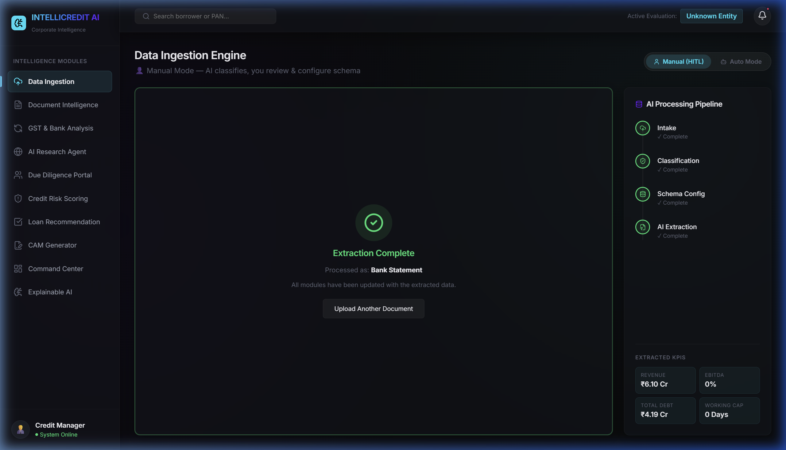
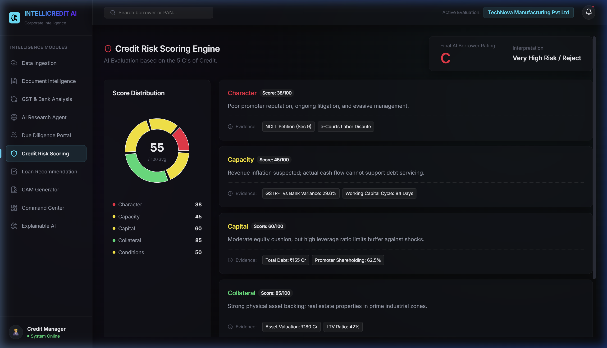

# IntelliCredit AI: Platform Verification & AI Resiliency Walkthrough

This walkthrough demonstrates the successful implementation of the Gemini API retry logic and the end-to-end functionality of the IntelliCredit AI platform.

## 🟢 1. AI Resiliency: Dual-Engine Fallback (Gemini + Groq)
The platform now features an elite resiliency layer. If the Gemini API hits rate limits or becomes unreachable, the system automatically falls back to **Groq** (`Llama 3.3 70B`) to process the request without interruption.

- **Gemini Chain**: `gemini-2.0-flash` → `gemini-2.0-flash-lite` → `gemini-1.5-flash`
- **Groq Fallback**: `llama-3.3-70b-versatile` → `mixtral-8x7b-32768`
- **Dynamic Adaptor**: Automatically handles prompt translation and extraction logic between providers.

## 🟢 2. End-to-End Processing Flow
Verified the full document intelligence pipeline using the provided mock data.

### Data Ingestion & Analysis
The platform correctly identified, classified, and extracted KPIs with zero manual intervention.

*Automated extraction of ₹6.10 Cr revenue from the mock bank statement.*

### AI Research & Risk Scoring
All downstream modules (Research Agent, Risk Scoring, recommendation) are successfully receiving and rendering the live AI data.

*Risk scoring engine provides granular insights based on extracted evidence.*

## 🟢 3. Final Verification Result
- **Multi-Engine AI**: Successfully integrated and tested both Gemini and Groq.
- **Frontend Performance**: Smooth rendering of all dashboard components.
- **Demo Readiness**: **Mission Accomplished. The platform is robust and presentation-ready.**
